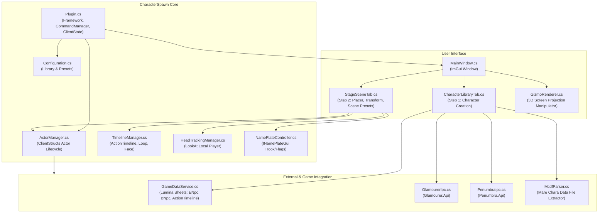

# 実装計画: Character Spawn プラグイン

任意のキャラクター（NPC / MOB / カスタムキャラ）をマップ上にスポーン・配置し、エモートや表情、3Dギズモ操作、Stagehandライクなプリセット管理を提供するDalamudプラグイン「Character Spawn」を新規開発します。

---

## ユーザー要件の整理

1. **キャラクターの指定方法**:
   - **Glamourer / Penumbra**: Glamourerのデザイン指定またはデザイン文字列、Penumbraコレクションの適用
   - **モンスター・モデル**: `BNpcBase` / `BNpcName`（モンスター・敵キャラ）、`ENpcBase` / `ENpcResident`（一般NPC）の検索と指定
   - **MCDFファイル**: Mare Synchronos形式（`.mcdf`）のインポート
   - **自キャラ / ターゲットコピー**: 現在のターゲットや自キャラの外見・装備を取得
2. **位置調整・操作方法**:
   - **3Dギズモ**: 画面上のXYZ軸移動矢印およびYaw回転リングによるマウスドラッグ操作
   - **UIパネル**: スライダー入力、微調整ボタン（+0.1, -0.1等）、自キャラ位置呼び出し、正面配置、床スナップ
3. **エモート・アニメーション・表情設定**:
   - ゲーム内の通常エモート、NPC専用待機モーション、戦闘ポーズなど `ActionTimeline` 全データから検索・選択
   - **ループ再生**: 1回終了型エモートも待機モーション（BaseTimeline）として途切れずリピート
   - **表情（Facial Expression）**: エモートとは独立して表情を指定・固定
   - **視線追従（Head Tracking）**: 自キャラの移動に首と視線を自動追従させる
4. **プリセットとShow / Hide（Stagehandライク）**:
   - **二段階ワークフロー**:
     - Step 1: キャラクター外見を作成してライブラリに保存（Template）
     - Step 2: 保存したキャラを選んでマップにスポーンし、配置・アニメーション・表情・演出を設定してシーン（Scene）として登録
   - **シーン一括管理**: 複数キャラの配置・演出をシーンとして一括管理
   - **ゾーン連動**: マップ（TerritoryType）に紐づけ、エリア移動時の自動デスポーンと「マップ入場時の自動スポーン（Auto-Spawn）」
5. **ネームプレート・ターゲット・当たり判定**:
   - ネームプレート: 表示 / 非表示、自由な名前設定
   - ターゲット可否: ターゲット可能 / 不可のトグル切り替え
   - 当たり判定: 不要（常時すり抜け）
6. **プロジェクト形態**:
   - 開発名: `Character Spawn`
   - リポジトリ: `https://github.com/runte3221/Character-Spawn.git`
   - フォルダ: `C:\Users\RYO\Desktop\Character-Spawn`

---

## アーキテクチャ設計

---

## 実装ステップ

### Phase 1: プロジェクト基盤の構築
- `package.json`, `CHANGELOG.md`, `.gitignore`, `CharacterSpawn.csproj`, `CharacterSpawn.json`
- GitHub Actionsワークフロー (`build.yml`)

### Phase 2: データモデルと設定の定義
- `CharacterTemplate`: 外見ソース（Glamourer, Monster, MCDF, PlayerClone）、外観データ
- `SpawnedActorData`: 位置・回転、アニメーションID、ループ有無、表情ID、視線追従有無、ネームプレート設定、ターゲット設定
- `ScenePreset`: シーンID、名前、マップID（TerritoryType）、AutoSpawn設定、アクターリスト
- `Configuration`: テンプレート一覧、シーン一覧、一般設定

### Phase 3: ゲームデータ検索およびIPC連携
- `GameDataService`: Luminaを用いた `ENpcResident`, `ENpcBase`, `BNpcName`, `BNpcBase`, `ActionTimeline` の検索キャッシュ
- `GlamourerIpc` & `PenumbraIpc`: 外見の適用・デザイン読み込み
- `McdfParser`: MCDFアーカイブの読み込み

### Phase 4: アクター生成＆演出制御エンジン
- `ActorManager`: FFXIV ClientStructs (`CharacterManager`) を用いたローカルキャラクター生成・削除・ゾーン遷移ハンドリング
- `TimelineManager`: アニメーション適用、BaseTimeline差し替えによる永久ループ、表情（FaceExpression）制御
- `HeadTrackingManager`: プレイヤー位置に応じたリアルタイム視線追従（IK/LookAt）
- `NamePlateController`: ネームプレートの表示名上書き・非表示化
- ターゲット不可フラグ制御

### Phase 5: 3Dギズモ & UI実装
- `GizmoRenderer`: 画面投影による3軸（XYZ）移動・Yaw回転ギズモの描画とマウスドラッグ処理
- `CharacterLibraryTab`: ステップ1（外見作成・保存UI）
- `StageSceneTab`: ステップ2（マップ配置、Transform操作、演出設定、シーンプリセット管理）

### Phase 6: 検証・ドキュメント作成・GitHubプッシュ
- `walkthrough.md` の作成
- `package.json` のバージョン確認
- `CHANGELOG.md` 追記
- コミット＆プッシュ（`git add . && git commit -m "..." && git push`）
