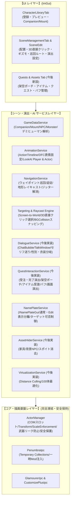

# 実装設計書: Character Spawn 最新版マスター開発計画 ＆ 開発記録統合仕様書

## 1. プロジェクトの究極目標と設計思想

### 【究極の目的】
**「Character Spawn」は、単なるキャラクター召喚ツールを超え、FFXIV の世界の中にプレイヤーが思い描く「生きたカスタムシーン、物語、クエスト、ロールプレイ空間、自律 NPC の生態系」を完全自作できる究極のワールド演出・シナリオエンジンである。**

### 【5大開発鉄則】
1. **第1工程コア（外見・スポーン描画パイプライン）の完全凍結**:
   - `ActorManager`、`ApplyAppearanceDirect`、`CustomizePlusIpc`、`PenumbraIpc` 等の完成済みコアを壊さない。
2. **完全モジュール隔離（Failure Isolation）**:
   - モーション、自律移動、会話、クエスト、アイテム、バフ、サウンド、アセット消去等の各機能は独立したサービスとして構築し、例外発生時も他を巻き込まない。
3. **ゲーム内本物データの不可侵・完全保護**:
   - 自キャラの Penumbra 設定、本物のゲーム内所持品（インベントリ）枠、本物の装備には一切干渉せず、すべてプラグイン内のローカルデータとして安全に完結させる。
4. **他プレイヤー視点およびサーバー安全性の徹底**:
   - 移動制限（鈍足・麻痺）などは自発的な減速としてサーバーに処理されるため、チート検知リスクはゼロ。アクターの自律移動もローカル完結のためサーバーパケットはゼロ。
5. **段階的・反復的なリリースと実機検証**:
   - 各ステップを小さく確実な単位で実装・検証・リリースを重ね、手戻りをゼロにする。

---

## 2. システム全体アーキテクチャ（最新版）



---

## 3. ここまでの開発記録・実装実績の総括 (v0.1.71.0 〜 v0.1.92.0)

本セッションおよび直近の開発スプリントにおいて、以下の全機能が実装・リリースされ、実機テストにて正常動作が確認されています。

| バージョン | 主要実装内容・課題解決 | コミット |
| :--- | :--- | :--- |
| **v0.1.71.0〜v0.1.75.0** | **アニメーション制御基盤 & 表情固定 & 速度・角度制限**<br>- HDM準拠の ActionTimeline 再生パイプライン構築<br>- Brio DFC 準拠の表情フリーズ機構（スロット2固定で待機動作と表情を両立）<br>- 首・視線追従（`LookAt Player`）と体幹回転角制限スライダー（`BodyTurnAngleLimit`）<br>- モンスター固有技および共通動作（通常攻撃・死亡・被弾等）の抽出対応 | `45eb74b`<br>`38e96d8` |
| **v0.1.76.0〜v0.1.77.0** | **アクター間相互注視 & デミヒューマン描画完全化**<br>- `LookAt Custom Spawn`（アクター同士の顔・目線・体幹追従）<br>- サキュバス等のデミヒューマン（Type 2）描画不具合の完全解消（SqPack解析によるBody単体モデル特定、ベースライン装備ゼロクリア）<br>- クライアント専用アクター（Puppet）への探索可能 `EntityId` および `TargetableStatus` 付与 | `e09fc26`<br>`4ee970d` |
| **v0.1.78.0〜v0.1.81.0** | **モーションお気に入り機能 & LookAt 距離自動Fit & デミヒューマン接頭辞**<br>- モーション行の星アイコン（★/☆）とお気に入り永続保存、`Favorite` カテゴリ新設<br>- `LookAtMaxDistance` デフォルト拡大（15m）、実距離表示および自動調整（Fit）ボタン新設<br>- デミヒューマン骨格接頭辞（`d1016`）とモデル番号検索対応 | `7660710`<br>`3e6e91e` |
| **v0.1.82.0〜v0.1.84.0** | **自律移動AI & ウェイポイント巡回 & 追従・帰還ステートマシン**<br>- `NavigationService` による自律移動（Waypoint巡回: Loop / PingPong / Once）<br>- プレイヤー接近追従（Trigger Distance, Stop Distance）と初期位置帰還（Home Position）<br>- 移動アニメーション（Walk / Run）自動同期と滑らかな回転補間（Slerp）<br>- 3Dギズモ描画（巡回パス、Trigger/Stop/Turn円弧オーバーレイ、Show Rangesトグル） | `23222bf`<br>`0fb4ebb` |
| **v0.1.85.0〜v0.1.87.0** | **自キャラ抜刀時の武器リーク防止 & 0xC0000005クラッシュ完全根絶**<br>- 自キャラが抜刀した状態でShowを行った際、モンスターやサキュバス、NPC（アリゼー等）がプレイヤー武器を持ってしまう問題を解決<br>- 危険な `WeaponData` ゼロクリアによるメモリ破損（Access Violation 0xC0000005）を根絶<br>- 武器非表示フラグ（`IsWeaponHidden = true`）およびNPC固有武器の安全な保持・ロード機構を確立 | `24ce196`<br>`1e33077`<br>`042e9c6` |
| **v0.1.88.0** | **階段・段差の自動適応（地形レイキャスト）**<br>- 巡回移動時に階段や段差で地面にめり込む問題を解決<br>- FFXIVネイティブの `BGCollision` レイキャスト（`RaycastDown`）を統合し、リアルタイム地形コライダー高度へ滑らかにスナッピング（Lerp） | `1b5fb44` |
| **v0.1.89.0〜v0.1.90.0** | **3Dモデル直接クリック選択 & 追従停止時ジッター解消 & 全種別対応**<br>- スポーン一覧から探す手間を解消するため、3Dシーン上のモデルを直接左クリックして SceneEditWindow の選択を切り替えられる機能を実装<br>- カメラ投影行列（`WorldToScreen`）による画面空間距離判定とゲーム内ターゲットシステムの連動<br>- 追従停止時に段差で激しく上下に揺れるジッターを、高度制御の `BGCollision` 一元化により解消<br>- 人型だけでなくモンスター・デミヒューマン・マウント・ミニオン全種別の直接選択・ターゲット対応 | `31053b8`<br>`6a2fd4a` |
| **v0.1.91.0〜v0.1.92.0** | **ネームプレート表示ルール & ターゲット可否制御の分離**<br>- Editウィンドウ表示中は全アクターのネームプレートを表示して編集を容易にし、Edit非表示（通常時）は `[x] Custom Name` 有効時のみ表示（新規はデフォルト非表示）<br>- Edit非表示時のターゲット可否制御：通常モードではカスタムネーム表示中のみゲーム内でターゲット可能にし、一般モブや背景NPCはターゲット不可にして誤選択を防止。Edit中は全アクターをターゲット可能にして直接クリック選択を維持 | `855d253`<br>`59872c5` |

---

## 4. 最新版マスター開発計画書（全7ステップ完全版詳細設計）

### 【Step 1】キャラクター種別の完全網羅（ミニオン・マウント登録） - 【完了】
- **実績**: Lumina の `Companion` シートおよび `Mount` シートから検索・登録・スポーン・拡縮（0.01x〜10.0x）・移動・アニメーションの完全動作を達成。

---

### 【Step 2】アクター・ポージング・モーション ＆ 自律移動 AI 統合 - 【85% 完了 / 次期スプリントで完成】
- **完了済み機能**:
  - ActionTimeline モーション再生 ＆ ループ ＆ 速度変更（0.1x〜3.0x）
  - 表情固定（DFC準拠スロット2フリーズ）
  - 視線追従（`LookAt Player`, `LookAt Custom Spawn`, 距離制限, 体幹角度制限, 自動Fit）
  - ウェイポイント巡回移動（速度選択: Walk/Run, ループ方式: Loop/PingPong/Once）
  - プレイヤー接近追従 ＆ ホームポジション帰還 AI
  - 地形レイキャストによる階段・坂道の自動高度スナッピング
  - 3Dモデル直接クリック選択 ＆ ネームプレート・ターゲット制御
- **残課題（次期スプリント実装対象）**:
  1. **ウェイポイント（Waypoints）とモーション・エモート・表情・セリフの連動**:
     - 各ウェイポイントに到着時アクション設定を追加（待機秒数 WaitTime、再生モーション/エモートID、表情ID、セリフText）。
     - 地点Aに到着したら「周囲を見回す（3秒）」、地点Bに到着したら「手を振る＆笑顔（5秒）」といった自然な巡回演出。
  2. **巡回＋追従の連携高度化（動的復帰）**:
     - 巡回移動中にプレイヤーを検知して追従へ移行したアクターが、プレイヤー離脱後に直近または次のウェイポイントへ自然に復帰して巡回を再開するステート復帰機構。
     - 巡回ルートからの最大許容離脱距離（Leash Range）の設定。
  3. **Brio ポーズ固定（Idle / Freeze）の統合**:
     - Brio の `.pose` ファイル（MessagePack / JSON）を読み込み。
     - 通常フィールド上で Havok ボーン姿勢を固定注入し、指定ポーズのまま静止・配置。

---

### 【Step 3】Embedded Modpack（内包 Mod パック）実装
- **概要**:
  - シーン配置やテンプレートに独自の Mod ファイル置換定義を紐付け、Penumbra 本体を汚さずにメモリ上で個別注入。
- **機能一覧**:
  1. **モンスターへの個別 MOD 適用**: 特定のモンスターにのみ専用 MOD を適用し、原種との同時配置を可能にする。
  2. **同一エモートに対する別 MOD 割り当て**:
     - Penumbra の `LoadTimelineResources` フックと連動。
     - 同じ「もみ手をする」エモートでも、キャラ 1 はダンス A、キャラ 2 はダンス B を踊る完全な出し分けを実現。

---

### 【Step 4】会話（チャットバブル・セリフ枠・性別＆衣装分岐）＆ ネームプレート演出
- **概要**:
  - ゲーム内公式テクスチャを用いた完全な会話演出とネームプレート制御。
- **機能一覧**:
  1. **チャットバブル（Balloon）**:
     - ネイティブテクスチャ（`MiniTalkPlayer_hr1.tex`）による本物の吹き出し。
     - 枠デザイン（Say, Party, Tell, Yell 等）および 16 色以上のグラデーション選択。
     - 接近表示トリガーおよびキャラクター頭上への矢印追従。
  2. **メッセージウィンドウ（Talk）**:
     - ネイティブテクスチャ（`Talk_Basic_hr1.tex`, `Talk_Other_hr1.tex`）による本物のセリフ枠。
     - スタイル選択（通常、心の声、超える力、機械、叫び、羊皮紙、通信、ナレーション）。
     - アクター選択時の会話開始、クリックによる「次へ送り（▼カーソル）」、終了シーケンス。
  3. **スマートセリフ条件分岐エンジン (Conditions)**:
     - **性別分岐**: 自キャラの現在の性別（Glamourer リアルタイム反映）に応じたセリフ分岐（男性時 / 女性時）。
     - **特殊衣装・Glamourer 検知**: 特定の Glamourer デザイン（例: 目隠し）や特定アイテム装備時に特殊セリフを発言。
  4. **ネームプレート・称号制御**:
     - Dalamud 公式 `INamePlateGui` を使用し、ネームプレート非表示やカスタム称号（`<街角の商人>`等）の設定。

---

### 【Step 5】インタラクション ＆ クエストエンジン
- **概要**:
  - 専用の「Quests & Assets」タブを新設し、架空ポーチ、アイテム、クエスト受注・完了演出、カスタムバフ、画面演出、移動制御を統合。
- **機能一覧**:
  1. **専用管理タブ（Quests & Assets）**:
     - カスタムアイテム作成（名称、アイコン、説明文、使用時リキャスト、消費型設定）。
     - カスタムバフ作成（名称、アイコン、説明文、効果時間、スタック数、付随効果）。
     - クエストマスター作成（タイトル、バナー画像、あらすじ、依頼主、報酬アイテム）。
  2. **SceneEditWindow への Quest 紐付け**:
     - アクターにクエスト（依頼主 / 報告先）を割り当て。
     - 頭上クエストアイコン（受注「！」、進行中、完了「？」）の 3D 追従表示。
  3. **クエスト受注・確認画面（JournalAccept）＆ 完了演出**:
     - 公式テクスチャ（`Journal_hr1.tex`）によるクエスト画面（受託/拒否ボタン）。
     - 完了時の「QUEST COMPLETE」ゴールドバナーエフェクト ＆ 完了ファンファーレ（SE）再生。
  4. **架空アイテムポーチ (Custom Inventory)**:
     - ゲーム内所持品枠に一切干渉しない完全安全なローカルインベントリ。
     - アクターとの会話を通じたアイテム受渡・納品イベント。
  5. **全画面ポストプロセス演出 (Screen Effects)**:
     - ホワイトアウト（エーテル酔い）、ピンクフェード（魅了/誘惑）、パープル（毒）、暗転（気絶/暗闇）。
  6. **安全な移動制御**:
     - クライアント側移動入力制御による鈍足（50%）および麻痺（スタン・0%）（他プレイヤー・サーバー完全安全）。

---

### 【Step 6】空間演出 ＆ スポイト消去
- **概要**:
  - 3D 音響と、邪魔な背景アセットや既存 NPC のピンポイント消去による空間のクリーンアップ。
- **機能一覧**:
  1. **3D 空間サウンド**: アクターにボイス・環境音を紐付け、距離減衰による立体音響再生。
  2. **アセット ＆ 既存 NPC スポイト消去**:
     - カメラレイキャストによる選択。
     - 既存家具・小道具の消去。
     - ターゲット可能な通常 NPC、およびターゲットできない背景 NPC（クラウド NPC）の消去。
     - NPC の「名前（ネームプレート）だけ」の非表示化。
     - シーンデータとしての保存・復元。

---

### 【Step 7】大規模シーン動的仮想化（Distance Culling）
- **概要**:
  - 街や大部隊など 100 体規模のシーンを構築しても FPS 低下や VRAM クラッシュを起こさない最適化基盤。
- **機能一覧**:
  1. **距離ベース動的仮想化 (Distance Culling)**:
     - プレイヤー周囲（50m以内等）のみ動的スポーンし、常時実体化数を 20〜30 体程度に自動制御。
  2. **非同期優先度スポーン (Staggered Spawning)**:
     - フレーム分散スポーンにより、一括召喚時のスタッターを完全排除。

---

## 5. 次期開発スプリント詳細設計（Step 2 完了：ウェイポイント演出連動 ＆ 追従復帰高度化）

### 1. ウェイポイント演出連動データ構造
```csharp
public class SceneWaypoint
{
    public Vector3 Position { get; set; }
    public float WaitTimeSeconds { get; set; } = 0.0f; // 到着時待機秒数（0なら即次地点へ）
    public ushort TimelineId { get; set; } = 0;        // 到着時再生モーションID
    public ushort FacialTimelineId { get; set; } = 0;  // 到着時再生表情ID
    public string DialogueText { get; set; } = string.Empty; // 到着時発言セリフ（吹き出し連動準備）
}
```

### 2. 状態遷移マシン（State Machine）の拡張
- `Patrol` 状態において目標ウェイポイントに到達（距離 < 0.5m）した際：
  - もし `WaitTimeSeconds > 0` ならば、新ステート `PatrolWait` へ遷移。
  - `TimelineId` / `FacialTimelineId` を `AnimationService` に指示して再生。
  - タイマーカウントが満了したら、元の通常待機モーションに復帰し、次のウェイポイントへ移動再開。
- `Follow` 状態からプレイヤーが離脱（距離 > LeashRange）した際：
  - 巡回ルートを持つアクターの場合、初期位置（Home）ではなく **直近の巡回ウェイポイント（または中断した次のウェイポイント）** へ移動して巡回ステートにシームレス復帰。
