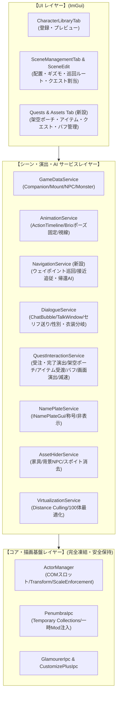

# 実装設計書: Character Spawn マスター開発計画（全7ステップ完全版詳細設計）

## 1. プロジェクトの究極目標と設計思想

### 【究極の目的】
**「Character Spawn」は、単なるキャラクター召喚ツールを超え、FFXIV の世界の中にプレイヤーが思い描く「生きたカスタムシーン、物語、クエスト、ロールプレイ空間、自律 NPC の生態系」を完全自作できる究極のワールド演出・シナリオエンジンである。**

### 【5大開発鉄則】
1. **第1工程コア（外見・スポーン描画パイプライン）の完全凍結**:
   - `ActorManager`、`ApplyAppearanceDirect`、`CustomizePlusIpc`、`PenumbraIpc` 等の完成済みコアを壊さない。
2. **完全モジュール隔離（Failure Isolation）**:
   - モーション、自律移動、会話、クエスト、アイテム、バフ、サウンド、アセット消去等の各機能は独立したサービスとして構築し、例外発生時も他を巻き込まない。
3. **ゲーム内本物データの不可侵・完全保護**:
   - 自キャラの Penumbra 設定、本物のゲーム内所持品（インベントリ）枠、本物の装備には一切干渉せず、すべてプラグイン内のローカルデータとして安全に完結させる。
4. **他プレイヤー視点およびサーバー安全性の徹底**:
   - 移動制限（鈍足・麻痺）などは自発的な減速としてサーバーに処理されるため、チート検知リスクはゼロ。アクターの自律移動もローカル完結のためサーバーパケットはゼロ。
5. **段階的・反復的なリリースと実機検証**:
   - Step 1 から順に小さく確実な単位で実装・検証・リリースを重ね、手戻りをゼロにする。

---

## 2. システム全体アーキテクチャ

---

## 3. 各ステップの詳細仕様設計

### 【Step 1】キャラクター種別の完全網羅（ミニオン・マウント登録）
- **概要**:
  - 第1工程の最終ピースとして、5つ目のカテゴリ「Mount / Minion」を新設。
  - Lumina の `Companion` シートおよび `Mount` シートから検索・登録。
- **データ構造**:
  - `CharacterSourceType`: `Companion`, `Mount`（または `MountMinion`）
  - ミニオンやマウントは、内部的にはモンスターやデミヒューマンと同一の `ModelCharaId` を持つ。
- **描画・スポーン**:
  - モンスター共通パイプライン（パイプライン D）を活用し、単独アクターとしてスポーン。
  - リアルタイムスケール（拡大縮小: 0.01x〜10.0x）、移動・回転、アニメーションがすべて機能。

---

### 【Step 2】アクター・ポージング・モーション ＆ 自律移動 AI 統合
- **概要**:
  - シーンに配置したキャラクターに命を吹き込み、直立不動から「ポーズ」「モーション」「自律歩行」「プレイヤーへの歩み寄り」までを一貫して制御。
- **機能一覧**:
  1. **ActionTimeline モーション再生**: ゲーム内約1万種のアニメーションキーから選択・ループ再生。
  2. **表情固定**: 表情専用スロットに表情タイムライン（笑顔、怒り等）を注入。
  3. **視線追従 (LookAt / Head Tracking)**: 自キャラの移動に合わせて首と視線が自然に追尾。
  4. **Brio ポーズ固定 (Idle / Freeze)**:
     - Brio の `.pose` ファイル（MessagePack / JSON）を読み込み。
     - 通常フィールド上で Havok ボーン姿勢を毎フレーム固定注入し、指定ポーズのまま静止・配置。
  5. **ウェイポイント指定ルート巡回（パトロール移動 ＆ 地点別モーション連動）**:
     - 複数通過地点（Waypoint A → B → C...）の 3D ギズモ設定。
     - 速度選択（歩き 2m/s、小走り 4m/s、走り 6m/s）と滑らかな座標・向き補間（Lerp）。
     - 地点到着時アクション（一定秒数待機、指定モーション再生、セリフ表示）。
     - 巡回ループ方式（循環・往復・片道停止）。
  6. **プレイヤー接近時の追従・追尾（歩み寄り）＆ テリトリー境界帰還 AI**:
     - プレイヤーが近づいた時（例: 4m 以内）に自キャラに向かって歩み寄る追尾ステートマシン。
     - 自キャラが逃げて離れた場合、または初期位置から離れすぎた（境界制限: 例 8m 超過）場合に、初期立ち位置（Home Position）へ自動帰還して待機に復帰。

---

### 【Step 3】Embedded Modpack（内包 Mod パック）実装
- **概要**:
  - シーン配置やテンプレートに独自の Mod ファイル置換定義を紐付け、Penumbra 本体を汚さずにメモリ上で個別注入。
- **機能一覧**:
  1. **モンスターへの個別 MOD 適用**: 特定のモンスターにのみ専用 MOD を適用し、原種との同時配置を可能にする。
  2. **同一エモートに対する別 MOD 割り当て**:
     - Penumbra の `LoadTimelineResources` フックと連動。
     - 同じ「もみ手をする」エモートでも、キャラ 1 はダンス A、キャラ 2 はダンス B を踊る完全な出し分けを実現。

---

### 【Step 4】会話（チャットバブル・セリフ枠・性別＆衣装分岐）＆ ネームプレート演出
- **概要**:
  - ゲーム内公式テクスチャを用いた完全な会話演出とネームプレート制御。
- **機能一覧**:
  1. **チャットバブル（Balloon）**:
     - ネイティブテクスチャ（`MiniTalkPlayer_hr1.tex`）による本物の吹き出し。
     - 枠デザイン（Say, Party, Tell, Yell 等）および 16 色以上のグラデーション選択。
     - 接近表示トリガーおよびキャラクター頭上への矢印追従。
  2. **メッセージウィンドウ（Talk）**:
     - ネイティブテクスチャ（`Talk_Basic_hr1.tex`, `Talk_Other_hr1.tex`）による本物のセリフ枠。
     - スタイル選択（通常、心の声、超える力、機械、叫び、羊皮紙、通信、ナレーション）。
     - アクター選択時の会話開始、クリックによる「次へ送り（▼カーソル）」、終了シーケンス。
  3. **スマートセリフ条件分岐エンジン (Conditions)**:
     - **性別分岐**: 自キャラの現在の性別（Glamourer リアルタイム反映）に応じたセリフ分岐（男性時 / 女性時）。
     - **特殊衣装・Glamourer 検知**: 特定の Glamourer デザイン（例: 目隠し）や特定アイテム装備時に特殊セリフを発言。
  4. **ネームプレート・称号制御**:
     - Dalamud 公式 `INamePlateGui` を使用し、ネームプレート非表示やカスタム称号（`<街角の商人>`等）の設定。

---

### 【Step 5】インタラクション ＆ クエストエンジン
- **概要**:
  - 専用の「Quests & Assets」タブを新設し、架空ポーチ、アイテム、クエスト受注・完了演出、カスタムバフ、画面演出、移動制御を統合。
- **機能一覧**:
  1. **専用管理タブ（Quests & Assets）**:
     - カスタムアイテム作成（名称、アイコン、説明文、使用時リキャスト、消費型設定）。
     - カスタムバフ作成（名称、アイコン、説明文、効果時間、スタック数、付随効果）。
     - クエストマスター作成（タイトル、バナー画像、あらすじ、依頼主、報酬アイテム）。
  2. **SceneEditWindow への Quest 紐付け**:
     - アクターにクエスト（依頼主 / 報告先）を割り当て。
     - 頭上クエストアイコン（受注「！」、進行中、完了「？」）の 3D 追従表示。
  3. **クエスト受注・確認画面（JournalAccept）＆ 完了演出**:
     - 公式テクスチャ（`Journal_hr1.tex`）によるクエスト画面（受託/拒否ボタン）。
     - 完了時の「QUEST COMPLETE」ゴールドバナーエフェクト ＆ 完了ファンファーレ（SE）再生。
  4. **架空アイテムポーチ (Custom Inventory)**:
     - ゲーム内所持品枠に一切干渉しない完全安全なローカルインベントリ。
     - アクターとの会話を通じたアイテム受渡・納品イベント。
  5. **全画面ポストプロセス演出 (Screen Effects)**:
     - ホワイトアウト（エーテル酔い）、ピンクフェード（魅了/誘惑）、パープル（毒）、暗転（気絶/暗闇）。
  6. **安全な移動制御**:
     - クライアント側移動入力制御による鈍足（50%）および麻痺（スタン・0%）（他プレイヤー・サーバー完全安全）。

---

### 【Step 6】空間演出 ＆ スポイト消去
- **概要**:
  - 3D 音響と、邪魔な背景アセットや既存 NPC のピンポイント消去による空間のクリーンアップ。
- **機能一覧**:
  1. **3D 空間サウンド**: アクターにボイス・環境音を紐付け、距離減衰による立体音響再生。
  2. **アセット ＆ 既存 NPC スポイト消去**:
     - カメラレイキャストによる選択。
     - 既存家具・小道具の消去。
     - ターゲット可能な通常 NPC、およびターゲットできない背景 NPC（クラウド NPC）の消去。
     - NPC の「名前（ネームプレート）だけ」の非表示化。
     - シーンデータとしての保存・復元。

---

### 【Step 7】大規模シーン動的仮想化（Distance Culling）
- **概要**:
  - 街や大部隊など 100 体規模のシーンを構築しても FPS 低下や VRAM クラッシュを起こさない最適化基盤。
- **機能一覧**:
  1. **距離ベース動的仮想化 (Distance Culling)**:
     - プレイヤー周囲（50m以内等）のみ動的スポーンし、常時実体化数を 20〜30 体程度に自動制御。
  2. **非同期優先度スポーン (Staggered Spawning)**:
     - フレーム分散スポーンにより、一括召喚時のスタッターを完全排除。
