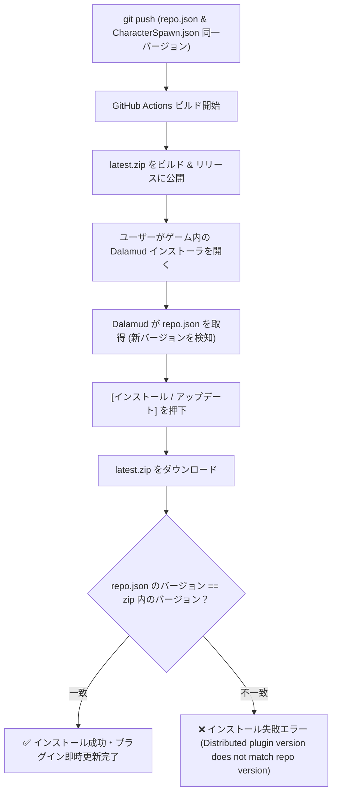

# Dalamud カスタムリポジトリ アップデート公式手順書

## 1. 今回発生した不具合の根本原因

Dalamud プラグインインストーラで表示されたエラー：
> 「プラグイン Character Spawn のインストールに失敗しました。ゲームを再起動して再試行してください。」

### Dalamud ログ（`dalamud.log`）の記録：
```
System.Exception: Distributed plugin version does not match repo version, distributed: 0.1.41.0 repo: 0.1.40.0
   at Dalamud.Plugin.Internal.PluginManager.InstallPluginInternalAsync(RemotePluginManifest repoManifest, Boolean useTesting, PluginLoadReason reason, Stream zipStream, LocalPlugin pluginToReplace)
   at Dalamud.Plugin.Internal.PluginManager.InstallPluginAsync(RemotePluginManifest repoManifest, Boolean useTesting, PluginLoadReason reason)
```

### 発生メカニズム：
1. Dalamud は、カスタムリポジトリ URL (`https://raw.githubusercontent.com/runte3221/Character-Spawn/main/repo.json`) を取得してプラグイン一覧を表示します。
2. ユーザーが [インストール] または [アップデート] を押すと、`repo.json` に記載された `DownloadLinkInstall`（`latest.zip`）をダウンロードします。
3. ダウンロードした zip 内の `CharacterSpawn.json` に書かれたバージョン（`0.1.41.0`）と、`repo.json` に書かれたバージョン（`0.1.40.0`）を厳密に比較照合します。
4. **バージョンが 1 文字でも食い違っている場合、Dalamud は改ざんや不正ビルドとみなして即座に例外をスローし、インストール処理を完全に破棄** します。
5. その結果、ユーザー側では「インストールに失敗しました」が表示され、ゲーム内には更新が一切反映されず、古いバージョンのまま動作し続けることになります。

---

## 2. 確立された必須アップデート手順

バージョン更新時は、必ず以下の **4 つのファイル** を同一のバージョン文字列に完全同期させてコミット・プッシュする必要があります。

### 対象ファイル一覧：
1. `CharacterSpawn.csproj`:
   `<Version>`, `<AssemblyVersion>`, `<FileVersion>`
2. `CharacterSpawn.json`:
   `"AssemblyVersion"` (プラグイン内包マニフェスト)
3. `repo.json`:
   `"AssemblyVersion"` (**最重要: Dalamud インストーラが参照するリモートマニフェスト**)
4. `CHANGELOG.md`:
   変更内容の追記

### ワンクリック自動化コマンド（推奨）：
プロジェクトルートで以下のコマンドを実行することで、上記 1〜3 のファイルを誤りなく一括更新できます。

```powershell
powershell -File tools/bump-version.ps1 0.1.42.0
```

その後、CHANGELOG を更新し、コミット & プッシュします：
```cmd
git add .
git commit -m "v0.1.42.0: ..."
git push
```

---

## 3. GitHub Actions と Dalamud インストーラの連携フロー



このルールを徹底することにより、今後は Dalamud インストーラ経由でのアップデートが 100% 確実に成功します。
