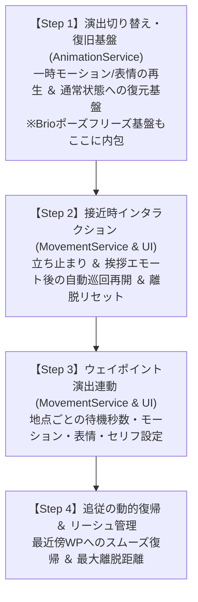

# 実装計画書: ウェイポイント演出連動・追従動的復帰・Brioポーズ統合準備

## 1. 概要と目的

マスター開発計画【Step 2 完了フェーズ】に基づき、以下の3大機能群を実装・統合します。

1. **ウェイポイント（Waypoints）と演出（モーション・エモート・表情・セリフ）の完全連動**:
   - ウェイポイント到着時に指定秒数待機（Wait Seconds）し、その間に個別指定されたモーション/エモート、表情（DFC準拠スロット2フリーズ）、およびセリフを自動再生。
   - 待機時間が終了すると元の待機モーションへ自然に復旧し、次の地点へ歩き出すリアルなNPC生態系の構築。
2. **接近時インタラクション（立ち止まり ＆ 挨拶エモート後の自動巡回再開）**:
   - 巡回中にプレイヤーが Trigger Dist の範囲内に入った際、その場で立ち止まる（Stop & Look）挙動を追加。
   - さらに「挨拶エモート＋表情を再生し、指定秒数後に元の巡回ルートへ復帰して歩き出す（Greet & Resume）」インテリジェントなリアクション機構を統合。
   - クールダウン時間（Cooldown）を設定し、プレイヤーが近くに留まっていても一度挨拶したら自然に巡回へ復帰。
3. **巡回＋追従の連携高度化（動的復帰 & リーシュ管理）**:
   - 追従モード時、プレイヤー離脱後に迷子にならず、現在地から最も近い（または進行方向上の）ウェイポイントを自動計算してシームレスに巡回へ復帰。
   - 巡回ルートからの最大許容離脱距離（Leash Range）を設けて過剰な追従を防止。
4. **Brio ポーズ固定（Idle / Freeze）の統合準備**:
   - 外部ポーズ（Brio / Anamnesis等）のボーン姿勢適用やアニメーションの完全静止（Freeze Frame）を可能にするアーキテクチャの先行整備。

---

## 2. 変更・拡張コンポーネント詳細

### (1) データモデル拡張 (`Models/SceneData.cs`)

#### 1. `SceneActorWaypoint`
```csharp
public class SceneActorWaypoint
{
    public Guid Id { get; set; } = Guid.NewGuid();
    public Vector3 Position { get; set; } = Vector3.Zero;
    public float WaitSeconds { get; set; } = 0.0f; // 到着時の待機秒数 (0 = ノンストップ)
    
    // 到着時演出
    public ushort ActionTimelineId { get; set; } = 0; // 到着時モーション (0=待機維持)
    public string ActionTimelineKey { get; set; } = string.Empty;
    public ushort FacialTimelineId { get; set; } = 0; // 到着時表情ID (0=変更なし)
    public string FacialKey { get; set; } = string.Empty;
    public string DialogueText { get; set; } = string.Empty; // 到着時セリフ
    
    public string Description { get; set; } = string.Empty;
}
```

#### 2. `ProximityReactionType` と `SceneActorMovementConfig`
```csharp
public enum ProximityReactionType
{
    Follow = 0,         // 従来の接近追従 (ついてくる)
    StopAndLook = 1,    // その場で立ち止まり、プレイヤーを見つめる (離脱で巡回再開)
    GreetAndResume = 2  // 立ち止まり、挨拶モーション/表情を再生して指定秒待機後に巡回再開
}

public class SceneActorMovementConfig
{
    // 既存プロパティ (Mode, LoopType, Speed, TurnSpeed, Waypoints, WalkTimelineId 等)
    ...
    // 接近時リアクション設定
    public ProximityReactionType ProximityReaction { get; set; } = ProximityReactionType.Follow;
    public ushort GreetTimelineId { get; set; } = 0;           // 挨拶モーションID (例: 挨拶・お辞儀・手を振る)
    public string GreetTimelineKey { get; set; } = string.Empty;
    public ushort GreetFacialId { get; set; } = 0;             // 挨拶時表情ID (笑顔など)
    public float GreetDurationSeconds { get; set; } = 3.0f;    // 挨拶待機秒数
    public float ReactionCooldownSeconds { get; set; } = 10.0f; // クールダウン秒数
    
    // 追従復帰オプション
    public bool ResumeNearestWaypoint { get; set; } = true;    // 離脱時に直近のWPへ復帰
    public float LeashRange { get; set; } = 15.0f;             // 巡回ルートからの最大追従許容距離
}
```

#### 3. `BrioPoseData` (将来統合に向けた基盤定義)
- ボーン名・回転（クォータニオン）・オフセット位置を保持するシリアライズ用モデルを定義。

---

### (2) アニメーションサービス拡張 (`Services/AnimationService.cs`)

1. **表情ダイレクト制御 (`ApplyFacialDirect`)**:
   - スロット2に表情タイムラインを流し込み、スロット速度を0にして表情をフリーズ固定。
2. **通常状態への安全な復旧 (`RestoreDefaultMotion`)**:
   - ウェイポイント待機終了時、または移動開始時に、アクターの基本設定（`SceneActorMotionConfig` の `TimelineId` / `FacialTimelineId`）に安全に復元するルーチンを新設。
3. **フレームフリーズ（ポーズ固定基盤）**:
   - アニメーションスロット0の速度を0.0fに設定することで、任意のモーションを特定フレームで完全静止させるフリーズ機能を追加。

---

### (3) 自律移動・巡回エンジン拡張 (`Services/MovementService.cs`)

1. **`WaitingAtWaypoint` 状態の完全連動**:
   - ウェイポイント到着時に `WaitSeconds > 0.05f` の場合：
     - 到着時モーション（`ActionTimelineId`）と表情（`FacialTimelineId`）を再生。
     - セリフ（`DialogueText`）が設定されている場合はログ出力・吹き出し準備通知。
   - タイマー満了時：
     - 基本モーションへ復帰（`animationService.RestoreDefaultMotion`）。
     - 次のウェイポイントへの移動状態（`MovingToWaypoint`）へ移行し、移動アニメーションを再開。
2. **接近時インタラクション（立ち止まり ＆ 挨拶エモート後の自動巡回再開）**:
   - `ProximityReactionType.StopAndLook`:
     - プレイヤーが Trigger Distance に入るとその場で足を止め、プレイヤーの方向を向いて見つめる。プレイヤーが離脱すると巡回へ復帰。
   - `ProximityReactionType.GreetAndResume`:
     - **停止 ＆ エモート再生**: 巡回中にプレイヤーが Trigger Distance 内に入ると、その場で足を止めてプレイヤーに向き直り、指定の挨拶モーション（`GreetTimelineId`）と表情（`GreetFacialId`）を再生。
     - **即時巡回再開**: **プレイヤーが範囲内に留まっていても**、指定秒数（`GreetDurationSeconds`）が経過したら元の待機モーションに復帰し、**迷わず巡回ルートへ歩き出して移動を再開**。
     - **範囲離脱による再トリガーリセット (Edge-Trigger with Exit Reset)**: 挨拶完了後は「トリガー済みフラグ」が立ち、プレイヤーが目の前にいても連続停止せず歩き去る。アクターが巡回してプレイヤーの範囲外へ一度離脱するとフラグが自動リセットされ、**「巡回から戻ってきたときに再度プレイヤーが範囲内にいれば、再び立ち止まって挨拶エモートを行う」** 自然なサイクルを実現。
3. **動的復帰（Dynamic Resume）ロジック**:
   - プレイヤーが追従範囲外へ離脱した際：
     - `config.ResumeNearestWaypoint` が有効な場合、アクターの現在地から全ウェイポイントの中で最もユークリッド距離が近い地点 `nearestIndex` を計算して `CurrentWaypointIndex` に設定。
     - そこへ向かってスムーズに歩き出し、到着後はその地点のインデックスから巡回をシームレスに続行。
   - リーシュ範囲（`LeashRange`）の超過判定：
     - 追従開始地点または巡回ルートから `LeashRange` 以上離れた場合は、プレイヤーが視界内にいても追従を打ち切って巡回ルートへ帰還。

---

### (4) UI拡張 (`UI/SceneEditWindow.cs`)

1. **ウェイポイント行の演出設定UI**:
   - 各ウェイポイント行に「演出 (⚙)」トグルボタンを配置。
   - 展開時に以下の設定パネルを表示：
     - 待機時間（秒）スライダー
     - モーション選択（一覧から選択またはID直接入力、クリアボタン）
     - 表情選択（一覧から選択またはID直接入力、クリアボタン）
     - セリフ入力テキストボックス
2. **追従連携・復帰オプション設定**:
   - 「[x] 追従離脱時に最も近いウェイポイントへ復帰する (Resume Nearest WP)」
   - 「最大追従離脱距離 (Leash Range)」スライダー

---

## 3. 段階的実装・検証ロードマップ（推奨着手順）



### 【Step 1】演出切り替え・復旧基盤 ＆ Brioポーズ統合準備 (`AnimationService.cs`, `SceneData.cs`)
- データモデル拡張: `SceneActorWaypoint` の演出プロパティ追加、`ProximityReactionType`、`BrioPoseData` 定義。
- `AnimationService` に以下の基盤を整備:
  - `ApplyFacialDirect(actor, facialId)`: 表情タイムライン再生＋スロット2フリーズ
  - `RestoreDefaultMotion(actor, defaultMotion)`: アクション終了時に通常待機モーション・表情へシームレス復帰
  - `FreezeCurrentFrame(actor)` / `UnfreezeFrame(actor)`: スロット0速度制御によるポーズ完全静止基盤

### 【Step 2】接近時インタラクション（立ち止まり ＆ 挨拶エモート後の自動巡回再開） (`MovementService.cs`, `SceneEditWindow.cs`)
- `MovementService` に接近時リアクションのステートマシンを実装:
  - `StopAndLook`: その場停止＆プレイヤー注視、離脱で巡回再開
  - `GreetAndResume`: その場停止＆挨拶エモート＋表情再生、プレイヤーが目の前にいても秒数経過で即座に巡回ルートへ歩行再開、範囲離脱で再トリガーリセット
- `SceneEditWindow` に接近時リアクション設定UI（リアクションタイプ、挨拶モーション/表情ピッカー、待機秒数）を追加。

### 【Step 3】ウェイポイント演出連動（地点ごとの待機・モーション・表情・セリフ） (`MovementService.cs`, `SceneEditWindow.cs`)
- `MovementService` の `WaitingAtWaypoint` ステートと `AnimationService` を連動。
- 到着時モーション・表情の再生と、タイマー終了時の自動復旧＆次地点移動。
- `SceneEditWindow` の各WP行に「演出 (⚙)」展開パネルを追加（待機時間、モーション/表情ピッカー、セリフ入力）。

### 【Step 4】追従の動的復帰 ＆ リーシュ管理 (`MovementService.cs`, `SceneEditWindow.cs`)
- 追従離脱時の最近傍ウェイポイント探索・復帰アルゴリズムの実装。
- 巡回ルートからの最大許容離脱距離（Leash Range）による安全帰還判定。
- `dotnet build` による完全検証、`CHANGELOG.md` 更新、バージョンバンプ、`walkthrough.md` 作成。
